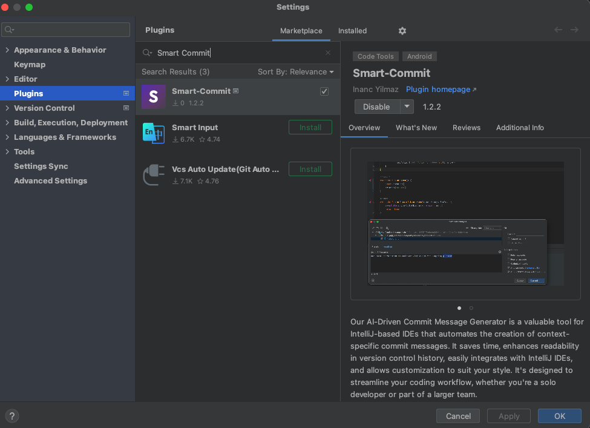
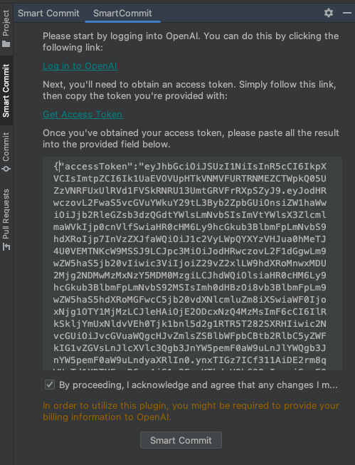
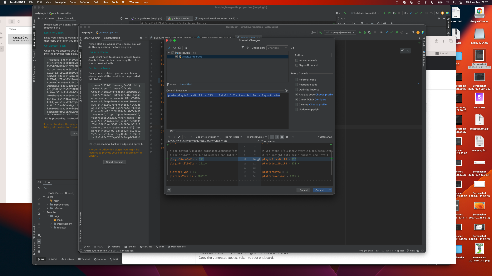

<!DOCTYPE html>
<html lang="en">

<head>
    <meta charset="UTF-8">
    <meta http-equiv="X-UA-Compatible" content="IE=edge">
    <meta name="viewport" content="width=device-width, initial-scale=1.0">
</head>

<body>
    <h1>Plugin Installation Guide</h1>
    
This guide provides step-by-step instructions on how to install and configure the Smart-Commit plugin in your
        IntelliJ IDE. The plugin allows you to integrate with OpenAI and access its features. Follow the instructions
        below to get started:

    <h2>1. Install the Plugin</h2>
    
    
You can download the Smart-Commit plugin directly from the IntelliJ Marketplace. Here's how to install it:

    <ol>
        <li>Open your IntelliJ IDE.</li>
        <li>Go to the File menu and select Settings (or Preferences on macOS).</li>
        <li>In the settings window, choose Plugins from the left sidebar.</li>
        <li>Click on the Marketplace tab.</li>
        <li>Search for "Smart-Commit" in the search bar.</li>
        <li>Locate the plugin in the search results and click the Install button next to it.</li>
        <li>Follow the on-screen instructions to complete the installation.</li>
        <li>Restart your IntelliJ IDE to activate the plugin.</li>
    </ol>
    <h2>2. Login to OpenAI and Get Access Token</h2>
    
    
To access OpenAI services and utilize the plugin's functionality, you need to obtain an access token by logging
        into your OpenAI account. Follow these steps to login and retrieve your access token:

    <ol>
        <li>Visit the OpenAI website at <a href="https://www.openai.com" target="_blank">www.openai.com</a> and click on
            the Login button.</li>
        <li>Enter your OpenAI account credentials and click Sign In.</li>
        <li>Once you are logged in, navigate to your account settings or developer dashboard.</li>
        <li>Locate the section for generating an access token or API key.</li>
        <li>Follow the instructions provided to generate a new access token.</li>
        <li>Copy the generated access token to your clipboard.</li>
    </ol>
    <h3>Configure the Plugin with your Access Token</h3>
    
    
After obtaining your access token, you need to configure the plugin to use it. Here's how to set it up:

    <ol>
        <li>Go back to your IntelliJ IDE.</li>
        <li>Open the Smart Commit section at the left side.</li>
        <li>Look for the option to enter your OpenAI access token or API key.</li>
        <li>Paste the access token you obtained earlier into the designated field.</li>
        <li>Save the changes.</li>
    </ol>
    
Congratulations! You have successfully installed the Smart-Commit plugin and configured it with your OpenAI
        access token. You can now utilize the plugin's features seamlessly within your IntelliJ IDE. Enjoy enhanced
        functionality and integration with OpenAI's powerful capabilities!

    <h4>Note:</h4>
    
It's important to keep your access token secure and not share it with others. Treat it as a sensitive piece of
        information to protect your OpenAI account.

    <h4>Warning:</h4>
    
The plugin might be required to enter your billing informations to Open-AI.

</body>
</html>
